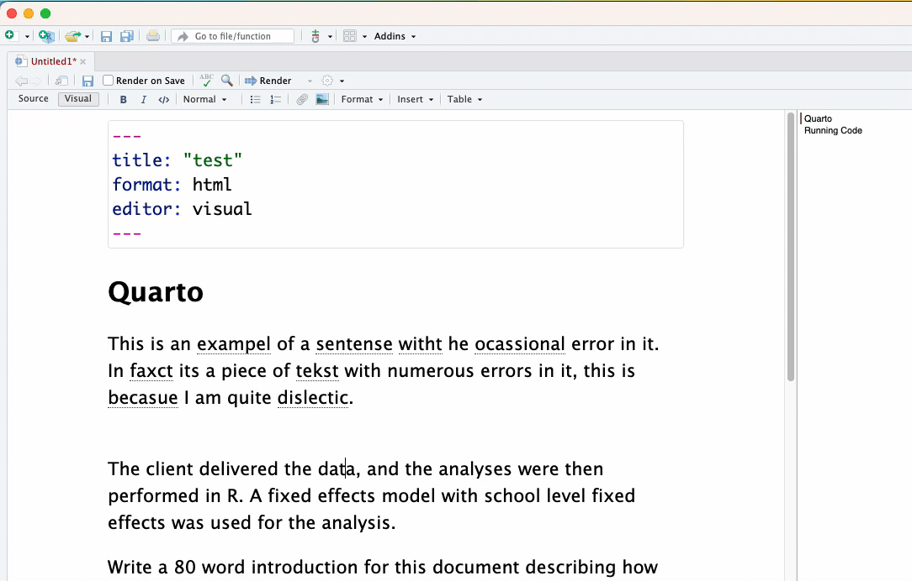
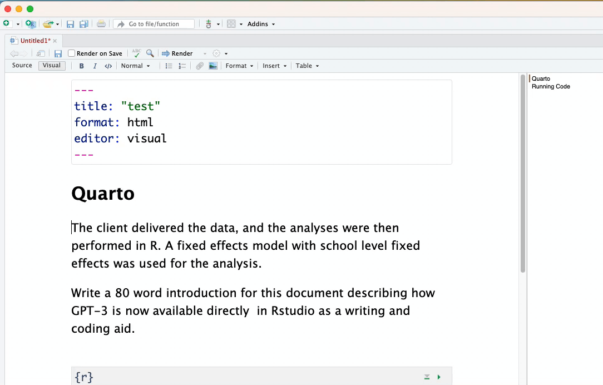
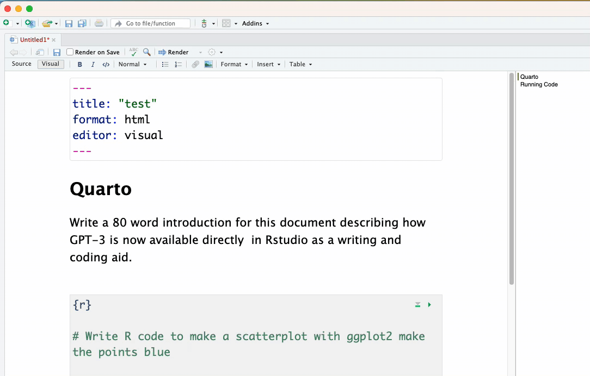
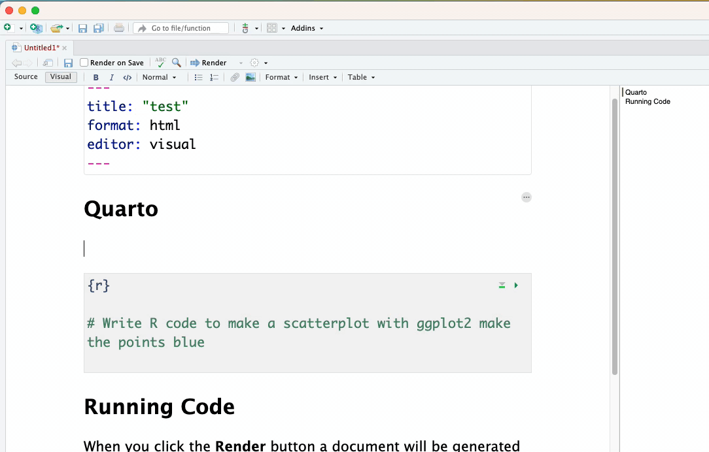
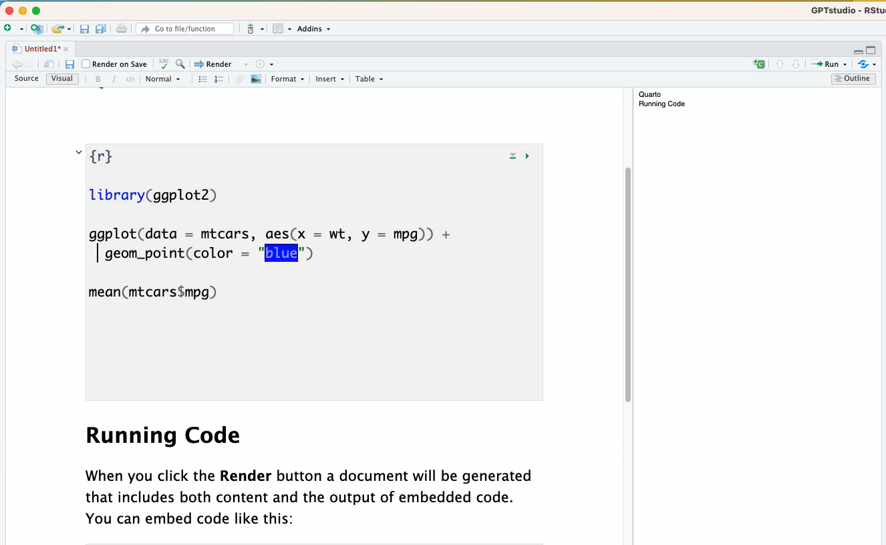
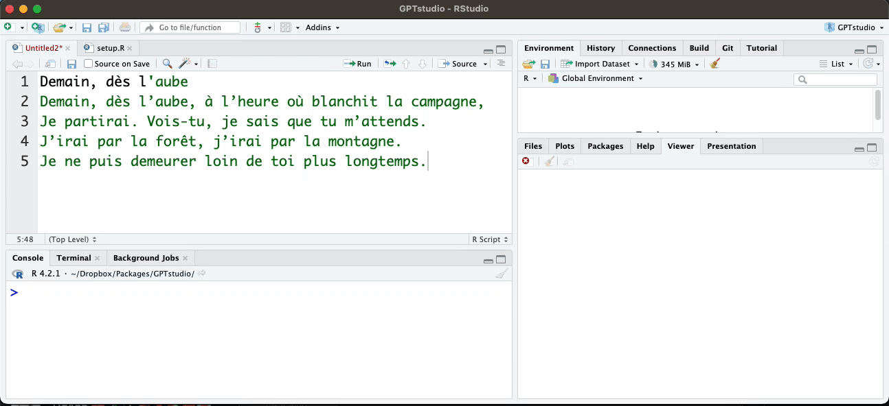

<!-- README.md is generated from README.Rmd. Please edit that file -->

```{r, include = FALSE}
knitr::opts_chunk$set(
  collapse = TRUE,
  comment = "#>",
  fig.path = "man/figures/README-",
  out.width = "100%"
)
```

# gptstudio 

<!-- badges: start -->
[](https://lifecycle.r-lib.org/articles/stages.html#experimental)
[](https://CRAN.R-project.org/package=GPTstudio)
[](https://github.com/JamesHWade/GPTstudio/actions/workflows/R-CMD-check.yaml)
[](https://app.codecov.io/gh/JamesHWade/GPTstudio?branch=main)
<!-- badges: end -->

The goal of gptstudio is for R programmers to easily incorporate use of large language models (LLMs) into their project workflows. These models appear to be a step change in our use of text for knowledge work, but you should carefully consider ethical implications of using these models. Ethics of LLMs (also called [Foundation Models](https://arxiv.org/abs/2108.07258)) is an area of very active discussion.

**read the privacy note at the bottom, this is alpha software there is no warranty for anything.**

## Prerequisites

1. Make an OpenAI account. As of now, the free one will do.

2. [Create an OpenAI API key](https://beta.openai.com/account/api-keys) to use `{openai}` package within Rstudio

3. Set the API key up in Rstudio in one of two ways:
  - By default, functions of `{openai}` will look for `OPENAI_API_KEY` environment variable. If you want to set a global environment variable, you can use the following command, where `"<APIKEY>"` should be replaced with your actual key:

```{r}
#| eval: false
Sys.setenv(OPENAI_API_KEY = "<OPENAI_API_KEY>")
```

  - Alternatively, you can set the key in your .Renviron file.

Otherwise, you can add the key to the .Renviron file of the project. The following commands will open .Renviron for editing:

```{r}
#| eval: false
require(usethis)
edit_r_environ(scope = "project")
```

You can add the following line to the file (again, replace xxxxxxxxxxxxxxxxxxxxxxxxxxxxxxxxxxxxxxxxxxxxxxxxxxx with your actual key):

```{.bash}
OPENAI_API_KEY=xxxxxxxxxxxxxxxxxxxxxxxxxxxxxxxxxxxxxxxxxxxxxxxxxxx
```

This now set the API key every time you start up this particular project. Note: If you are using GitHub/Gitlab, do not forget to add .Renviron to .gitignore!

## Install the addins from this package:

```{r}
#| eval: false
require(devtools)
install_github("MichelNivard/GPTstudio")
```

## Usage

Some examples of use.
 
### Spelling ang grammar check

**Addins > GPTSTUDIO > Spelling and Grammar:** Takes the selected text sends it to OpenAI's best model and instructs it to return a spelling and grammar checked version. 



### Active voice

**Addins > GPTSTUDIO > Change text to active voice:** Takes the selected text, sends it to OpenAI's best model and instructs it to return the text in  the active voice. 



#### Write/code from prompt

**Addins > GPTSTUDIO > Write/Code from prompt:** Takes the selected text and sends it to OpenAI as a prompt for the model to work with. This is most like the ChatGPT experience.

Text from prompt:



Code from prompt:




### Comment your code: 

**Addins > GPTSTUDIO > Comment your code:** Takes the selected text sends it to OpenAI as a prompt for a code specific model to work with, asks for a version with a comment added explaining the code line by line. 



### Provide your own instructions

**Addins > GPTSTUDIO > Freeform GPT editor:** Apply any edit what YOU desire or can dream up to a selection of code or text.




**Privacy note:** these functions work by taking the text or code you have highlighted/selected with the cursor and send these to OpenAI as part of a prompt, they fall under their privacy notice/rules/exceptions you agreed to with OpenAI when making an account. I do not know how secure these are when sent to OpenAI, I also don't know what OpenAI does with them. The code is designed to ONLY share the highlighted/selected text and no other elements of your R environment (i.e. data) unless you have highlighted it when running the addin. This may limit usability for now, but I do not want people to accidentally share sensitive data with OpenAI.


DO NOT HIGHLIGHT, AND THEREFORE UPLOAD, DATA/CODE/TEXT THAT SHOULD REMAIN PRIVATE

