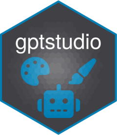

<!-- README.md is generated from README.Rmd. Please edit that file -->

# gptstudio 

<!-- badges: start -->

[](https://lifecycle.r-lib.org/articles/stages.html#experimental)
[](https://CRAN.R-project.org/package=gptstudio)
[](https://app.codecov.io/gh/MichelNivard/gptstudio?branch=main)
[](https://github.com/MichelNivard/gptstudio/actions/workflows/R-CMD-check.yaml)
[](https://www.r-pkg.org:443/pkg/gptstudio)
<!-- badges: end -->

The goal of gptstudio is for R programmers to easily incorporate use of
large language models (LLMs) into their project workflows. These models
appear to be a step change in our use of text for knowledge work, but
you should carefully consider ethical implications of using these
models. Ethics of LLMs (also called [Foundation
Models](https://arxiv.org/abs/2108.07258)) is an area of very active
discussion.

For further addins, tailored for R developers, also see the sister
package: [gpttools](https://jameshwade.github.io/gpttools/)

## Install the addins from this package:

``` r
install.packages("gptstudio")
```

To get a bug fix or to use a feature from the development version, you
can install the development version of this package from GitHub.

``` r
# install.packages("pak")
pak::pak("MichelNivard/gptstudio")
```

## Privacy Notice for gptstudio

This privacy notice is applicable to the R package that utilizes the
GPT-3 and GPT-3.5 API provided by OpenAI. By using this package, you
agree to adhere to the privacy terms and conditions set by OpenAI.

### Data Sharing with OpenAI

When using this R package, the text or code that you highlight/select
with your cursor, or the prompt you enter within the built-in
applications, will be sent to OpenAI as part of an API request. This
data sharing is governed by the privacy notice, rules, and exceptions
that you agreed to with OpenAI when creating an account.

### Security and Data Usage by OpenAI

We cannot guarantee the security of the data you send to OpenAI via the
API, nor can we provide details on how OpenAI processes or uses your
data. However, OpenAI has stated that they utilize prompts and results
to enhance their AI models, as outlined in their terms of use. You can
opt-out of this data usage by contacting OpenAI directly and making an
explicit request.

### Limiting Data Sharing

The R package is designed to share only the text or code that you
specifically highlight/select or include in a prompt through our
built-in applications. No other elements of your R environment will be
shared. It is your responsibility to ensure that you do not accidentally
share sensitive data with OpenAI.

**IMPORTANT: To maintain the privacy of your data, do not highlight,
include in a prompt, or otherwise upload any sensitive data, code, or
text that should remain confidential.**

## Prerequisites

1.  Make an OpenAI account.

2.  [Create an OpenAI API
    key](https://platform.openai.com/account/api-keys) to use with the
    package.

3.  Set the API key up in Rstudio

### Setting OpenAI API Key

By default, API calls will look for `OPENAI_API_KEY` environment
variable. If you want to set a global environment variable, you can use
the following command, where `"<APIKEY>"` should be replaced with your
actual key:

``` r
Sys.setenv(OPENAI_API_KEY = "<APIKEY>")
```

Otherwise, you can add the key to the .Renviron file of the project. The
following commands will open .Renviron for editing:

``` r
require(usethis)
edit_r_environ(scope = "project")
```

You can add the following line to .Renviron (again, replace `"<APIKEY>"`
with your actual key):

``` bash
OPENAI_API_KEY= "<APIKEY>")
```

This now set the API key every time you start up this particular
project. Note: If you are using GitHub/Gitlab, do not forget to add
.Renviron to .gitignore!

## Usage

Some examples of use.

### ChatGPT in RStudio

1.  **Addins \> GPTSTUDIO \> ChatGPT**
2.  Type your question.
3.  Click “Send” button
4.  Ask more questions
5.  Copy and try code

<video src="https://user-images.githubusercontent.com/19418298/239023191-ee6597fd-1447-43c7-b817-a5562173f067.mp4" data-canonical-src="https://user-images.githubusercontent.com/19418298/239023191-ee6597fd-1447-43c7-b817-a5562173f067.mp4" controls="controls" muted="muted" class="d-block rounded-bottom-2 border-top width-fit" style="max-height:640px; min-height: 200px">
</video>

The ChatGPT addin supports internationalization. You can set the
“GPTSTUDIO_LANGUAGE” environmental variable to the language of your
preference (i.e. `GPTSTUDIO_LANGUAGE="es"` for spanish). See the full
list of supported languages in the translation file
(`"inst/translations/translation.json"`).

### Provide your own instructions in R, R Markdown, or Quarto files

**Addins \> GPTSTUDIO \> ChatGPT in Source:** Apply any edit what YOU
desire or can dream up to a selection of code or text.

<video src="https://user-images.githubusercontent.com/6314313/225774578-72e4e966-a740-4afc-beca-1ac25abb504c.mov" controls="controls" muted="muted" class="d-block rounded-bottom-2 border-top width-fit" style="max-height:640px; min-height: 200px">
</video>

### Spelling ang grammar check

**Addins \> GPTSTUDIO \> Spelling and Grammar:** Takes the selected text
sends it to OpenAI’s best model and instructs it to return a spelling
and grammar checked version.

<figure>

<figcaption aria-hidden="true">spelling</figcaption>
</figure>

### Comment your code:

**Addins \> GPTSTUDIO \> Comment your code:** Takes the selected text
sends it to OpenAI as a prompt for a code specific model to work with,
asks for a version with a comment added explaining the code line by
line.

<figure>

<figcaption aria-hidden="true">add comments to code</figcaption>
</figure>

## Code of Conduct

Please note that the gptstudio project is released with a [Contributor
Code of
Conduct](https://github.com/MichelNivard/gptstudio/blob/main/.github/CODE_OF_CONDUCT.md).
By contributing to this project, you agree to abide by its terms.
